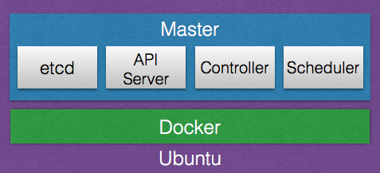
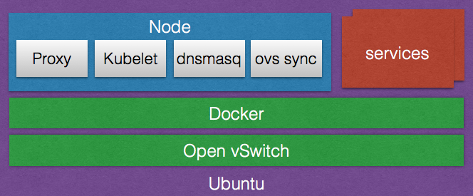

# DIY Kubernetes
WARNING: These instructions must be run as ``root``, and will expose all standard Kubernetes ports and a few non-standard ports to potential security attacks.  Use at your own risk.

## Option 1: Running Master and Node on same host.
Use this option for local development.  Tested on boot2docker, docker-machine, and Ubuntu baremetal.

### Run the Master
1. ```git clone https://github.com/mingfang/docker-kubernetes-master```
2. ```cd docker-kubernetes-master```
3. ```./build```
4. ```./run```
5. The Master is now running

### Run the Node
1. ```git clone https://github.com/mingfang/docker-kubernetes-node```
2. ```cd docker-kubernetes-node```
3. ```./build```
4. ```./run localhost```
5. The Node is now running

### Verify
1. ```alias kubectl='docker run --rm -it --net=host kubernetes-master kubectl'```
2. ```kubectl get nodes```
3. You should see one Node running
```
NAME        LABELS                                          STATUS
10.0.2.15   host=default,kubernetes.io/hostname=10.0.2.15   Ready
```

## Option 2: Running one Master and many Nodes on different hosts.
Use this option for creating larger clusters.  Tested on Ubuntu baremetal, KVM, AWS EC2, and Digital Ocean.

### Run the Master
(same as Option 1)

1. ```git clone https://github.com/mingfang/docker-kubernetes-master```
2. ```cd docker-kubernetes-master```
3. ```./build```
4. ```./run```
5. The Master is now running

### Run the Nodes(one per host)
Note: Tested on Ubuntu 16.04.  Newer versions should work but not tested.

1. ```apt-get install -y bridge-utils openvswitch-switch```
2. ```git clone https://github.com/mingfang/docker-kubernetes-node```
3. ```cd docker-kubernetes-node```
4. ```./build```
5. ```./ovs-setup.sh```
6. This script will setup the OpenvSwitch network. Follow the instructions at the end to reconfigure the Docker daemon.
7. ```service docker restart``` to restart the Docker daemon
8. ```./run <Master hostname>``` Note localhost will not work.
9. The Node is now running

Repeat for every host that runs the Nodes.

### Verify
1. ```alias kubectl='docker run --rm -it --net=host kubernetes-master kubectl'``` on the Master host
2. ```kubectl get nodes```
3. You should see all the Nodes running
```
NAME            LABELS                                            STATUS
192.168.1.160   host=minux,kubernetes.io/hostname=192.168.1.160   Ready
192.168.1.162   host=vm2,kubernetes.io/hostname=192.168.1.162     Ready
192.168.1.163   host=vm3,kubernetes.io/hostname=192.168.1.163     Ready
192.168.1.164   host=vm4,kubernetes.io/hostname=192.168.1.164     Ready
192.168.1.168   host=vm1,kubernetes.io/hostname=192.168.1.168     Ready
```

## DNS
In both options, each Node is it's own DNS sever using dnsmasq.  Every ```service``` will have a DNS entry that returns their ```service ip```.  

You can confirm this by running ```dig @localhost kubernetes``` on the Node host.  The output should look like this...
```
; <<>> DiG 9.9.5-3ubuntu0.5-Ubuntu <<>> @localhost kubernetes
; (1 server found)
;; global options: +cmd
;; Got answer:
;; ->>HEADER<<- opcode: QUERY, status: NOERROR, id: 53740
;; flags: qr aa rd ra ad; QUERY: 1, ANSWER: 1, AUTHORITY: 0, ADDITIONAL: 0

;; QUESTION SECTION:
;kubernetes.			IN	A

;; ANSWER SECTION:
kubernetes.		0	IN	A	10.1.1.1

;; Query time: 1 msec
;; SERVER: 127.0.0.1#53(127.0.0.1)
;; WHEN: Mon Oct 12 15:49:08 UTC 2015
;; MSG SIZE  rcvd: 44
```

## Master
[https://github.com/mingfang/docker-kubernetes-master](https://github.com/mingfang/docker-kubernetes-master)


## Node
[https://github.com/mingfang/docker-kubernetes-node](https://github.com/mingfang/docker-kubernetes-node)


## Service Router (Nginx)
[https://github.com/mingfang/docker-knginx](https://github.com/mingfang/docker-knginx)

## Networking (Open vSwitch)
https://github.com/kubernetes/kubernetes/blob/master/docs/admin/ovs-networking.md

http://openvswitch.org

## Ansible (Optional)
[https://github.com/mingfang/docker-ansible](https://github.com/mingfang/docker-ansible)

## Kubernetes Playbook
[https://github.com/mingfang/kubernetes-playbook](https://github.com/mingfang/kubernetes-playbook)
Use ```services.yml```(https://github.com/mingfang/kubernetes-playbook/blob/master/services.yml) to manage the entire cluster; It's like compose for Kubernetes.
